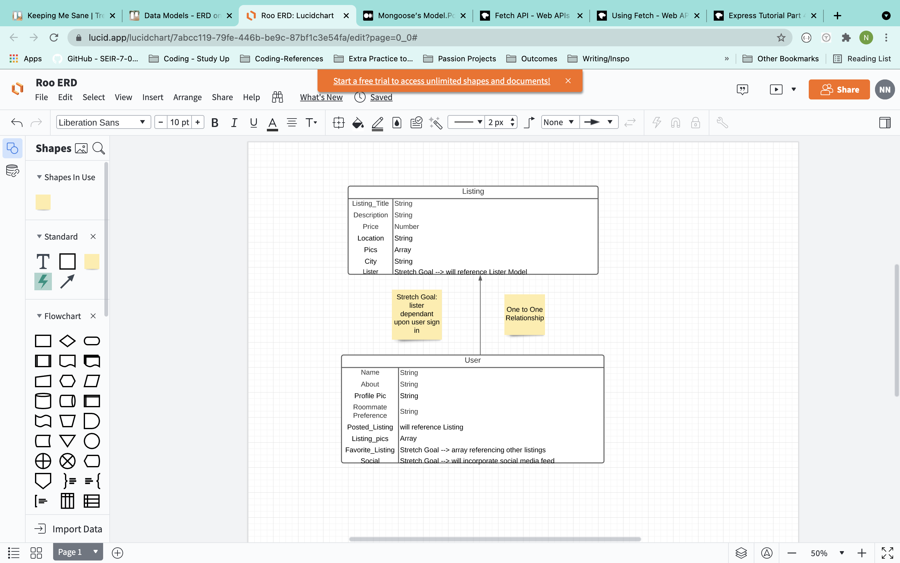

# Roo
Welcome to Roo, the place where you find your next roommate. Built to help anyone seeking a roommate. 

## Technologies Used
* Trello - project planning
* Figma - app design and mockups
* Node.js
* Javascript
* Express
* Express Sessions
* Mongoose & MongoDB
* CSS
* Sass
* React
    * React Carousel
    * React Router 
* Imgur - picture hosting
* Unsplash - picture library

## WireFrames
ERD and Route Flow - https://lucid.app/lucidchart/7abcc119-79fe-446b-be9c-87bf1c3e54fa/edit?page=0_0#

Figma Wireframes - https://www.figma.com/file/nWQFg85kIKSD9VX3J9i2UG/Roo?node-id=0%3A1

## User Stories
### Who is the user?
Our user is anyone who wants a low-fuss experience when searching for a roommate. Whether, they're ready to take the plunge and reach out to a member of the Roo community or just want to browse our current Roommates and Listings. 

### What can the user do?
* User can Navigate to a Locations page that shows them all the cities that currently have listings
* User can click on a city and go to a show page for all the listings within that city
* User can select a listing to view further information on or select the name of the lister to be taken to a profile page for the lister
* On the single listing show page the lister can see a carousel of pictures for that listing, additional details, and a static map with a marker of where the listing is
* The single listing show page also has an update and delete button for the latter half of CRUD functionality
* User can also navigate to a Add a Listing Page where they can add a listing to the site, if they're searching for a rooommate. They don't need to be logged in to add a listing
* User can signup and login to the Roo community
* If a User is logged in the navigation bar changes to offer them the options to logout or view their profile. 
* Users can also navigate to a Roommates page that shows all the listers with current listings. 

## Planned Features
With continued work, I'd like to create solutions for the features listed below:
* User to User Chat
* Contact Form
* Favorited Listings on Profile Page
* Picture Upload for ease
* Posted Listings on Profile Page
* Bug fixes

## Triumphs
Challenging myself to use React, which I wasn't comfortable with, and coming out by the end of project week with a functioning app was a huge win. Also, I pushed myself to work more on logic and functionality, which helped accelerate my comfort and knowledge through troubleshooting and thinking up solutions to unexpected propblems. 

## Challenges
Learning when to let go of certain features or stop working on something that wasn't going to be ready in time was something I learned. There are a few bugs triggered by gaps in logic as well, where I didn't cover every single possibility, that I hope to go back and fix.  